# MedQuest - Документация для дипломной работы

## Оглавление
1. [Описание проекта](#описание-проекта)
2. [Архитектура системы](#архитектура-системы)
3. [Функциональность](#функциональность)
4. [Новые функции в обновлении](#новые-функции-в-обновлении)
5. [Пошаговые примеры использования](#пошаговые-примеры-использования)
6. [Основные технологии](#основные-технологии)
7. [Структура данных](#структура-данных)
8. [Роли и права доступа](#роли-и-права-доступа)

---

## Описание проекта

**MedQuest** — это CRM-система (Customer Relationship Management) для медицинского центра, которая предназначена для:

- **Регистрации пациентов** — сохранение данных пациентов (ФИО, дата рождения, контакты, адрес)
- **Управления запросами** — создание и отслеживание медицинских запросов пациентов
- **Назначения врачей** — распределение запросов между врачами
- **Контроля статусов** — отслеживание прогресса выполнения запросов
- **Анализа статистики** — просмотр ключевых показателей на панели управления
- **Ведения аудита** — логирование всех действий в системе

**Новые функции в обновлении (май 2026):**
- **Google OAuth** — вход через аккаунт Google
- **Двухфакторная аутентификация (2FA)** — повышенная безопасность доступа
- **AI-Маршрутизатор** — автоматическое определение специалиста на основе жалобы
- **Avatar** — персональное изображение пользователя с инициалами
- **Детальный профиль пациента** — полная информация и история взаимодействия
- **Расписание** — календарь приёмов и видеоконсультаций
- **Видеоконференция** — встроенная видеосвязь для консультаций
- **Чат** — система обмена сообщениями между пользователями

Система разработана для использования в медицинских центрах с небольшим количеством сотрудников.

---

## Архитектура системы

### Общая структура

```
┌─────────────────────────────────────────────────────────────┐
│                     WEB-БРАУЗЕР (Frontend)                  │
│                  React + TypeScript + Tailwind              │
│  ┌──────────────────────────────────────────────────────┐   │
│  │ • Интерфейс пользователя                             │   │
│  │ • Управление состоянием (Redux/Zustand)             │   │
│  │ • HTTP запросы к API (Axios)                         │   │
│  └──────────────────────────────────────────────────────┘   │
└─────────────────────────────────────────────────────────────┘
                           ↓↑
                    HTTP/REST API
                           ↓↑
┌─────────────────────────────────────────────────────────────┐
│                   СЕРВЕР (Backend)                          │
│               FastAPI (Python) + SQLAlchemy                 │
│  ┌──────────────────────────────────────────────────────┐   │
│  │ • Обработка запросов                                 │   │
│  │ • Аутентификация (JWT токены)                        │   │
│  │ • Бизнес-логика                                      │   │
│  │ • Валидация данных (Pydantic)                        │   │
│  └──────────────────────────────────────────────────────┘   │
└─────────────────────────────────────────────────────────────┘
                           ↓↑
┌─────────────────────────────────────────────────────────────┐
│                       БАЗА ДАННЫХ                           │
│                       SQLite (MVP)                          │
│  ┌──────────────────────────────────────────────────────┐   │
│  │ • Таблица пользователей (Users)                      │   │
│  │ • Таблица пациентов (Patients)                       │   │
│  │ • Таблица запросов (Patient Requests)               │   │
│  │ • Таблица комментариев (Request Comments)           │   │
│  │ • Таблица аудита (Audit Logs)                       │   │
│  │ • Таблица уведомлений (Notifications)               │   │
│  └──────────────────────────────────────────────────────┘   │
└─────────────────────────────────────────────────────────────┘
```

### Технологический стек

| Компонент | Технология | Назначение |
|-----------|-----------|-----------|
| **Frontend** | React 18 + TypeScript | Создание пользовательского интерфейса |
| **Styling** | Tailwind CSS | Оформление интерфейса |
| **HTTP Client** | Axios | Обмен данными с сервером |
| **Backend** | FastAPI (Python) | REST API сервер |
| **ORM** | SQLAlchemy | Работа с базой данных |
| **Validation** | Pydantic | Валидация данных |
| **Auth** | JWT (JWT Tokens) | Аутентификация пользователей |
| **Database** | SQLite | Хранение данных |
| **Deployment** | Vercel (Frontend) | Хостинг приложения |

---

## Функциональность

### 1. Аутентификация (Вход в систему)

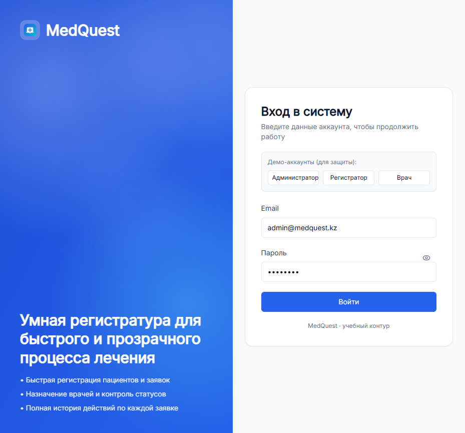

**Что это?** Первая страница, которую видит пользователь при открытии приложения.

**Возможности:**
- Вход с помощью email и пароля
- Демонстрационные аккаунты для быстрого тестирования:
  - **Администратор** (admin@medquest.kz / admin123)
  - **Регистратор** (registrar@medquest.kz / registrar123)
  - **Врач** (doctor@medquest.kz / doctor123)

**Как работает:**
1. Пользователь вводит email и пароль
2. Система проверяет учётные данные на сервере
3. При успехе выдаёт JWT токен (ключ доступа)
4. Токен сохраняется в браузере и используется для всех последующих запросов

---

### 2. Панель управления (Dashboard)

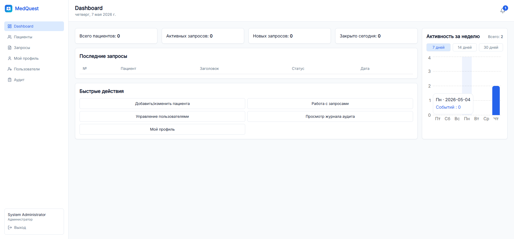
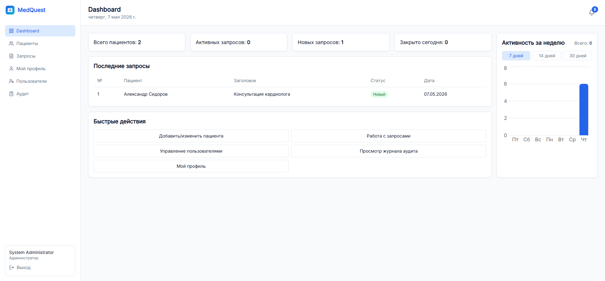

**Что это?** Главная страница, которая показывает обзор всех ключевых показателей.

**Компоненты на странице:**

#### Левая боковая панель (Навигация)
- **Dashboard** — главная страница со статистикой
- **Пациенты** — управление записями пациентов
- **Запросы** — управление медицинскими запросами
- **Мой профиль** — настройки личного аккаунта
- **Пользователи** — управление сотрудниками (только для администраторов)
- **Аудит** — просмотр логов действий (только для администраторов)

#### Основная область
- **Статистика по запросам** — количество запросов по статусам
- **Активные запросы** — список текущих запросов, требующих внимания
- **Статистика врачей** — кто из врачей получил сколько запросов
- **График активности** — визуализация нагрузки во времени

**Что можно делать:**
- Получить быстрый обзор текущей ситуации
- Увидеть критические показатели в одном месте

---

### 3. Управление пациентами

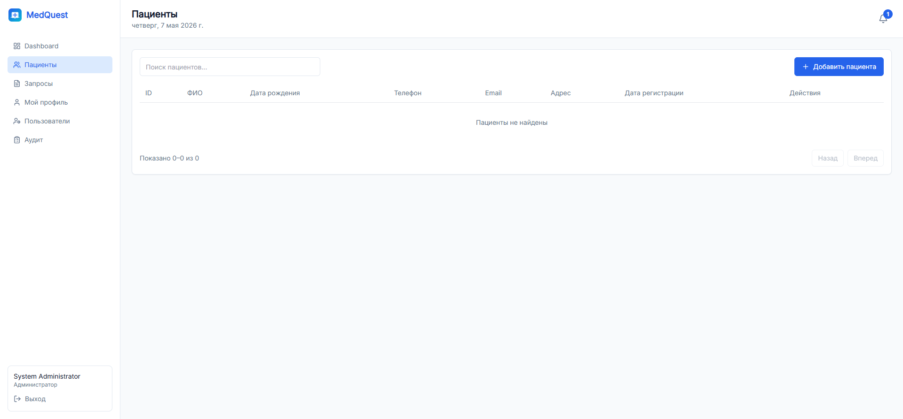
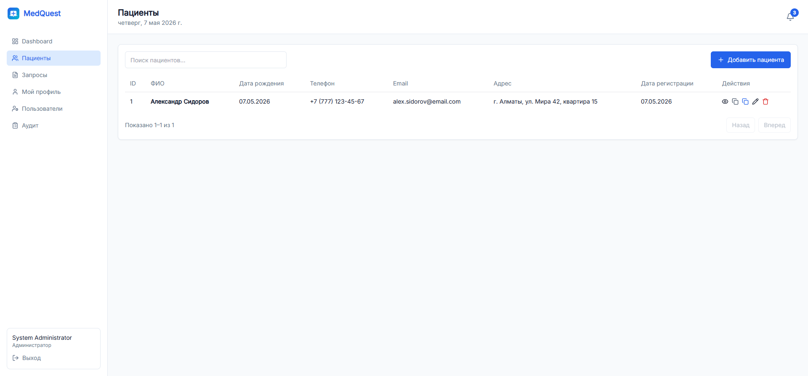
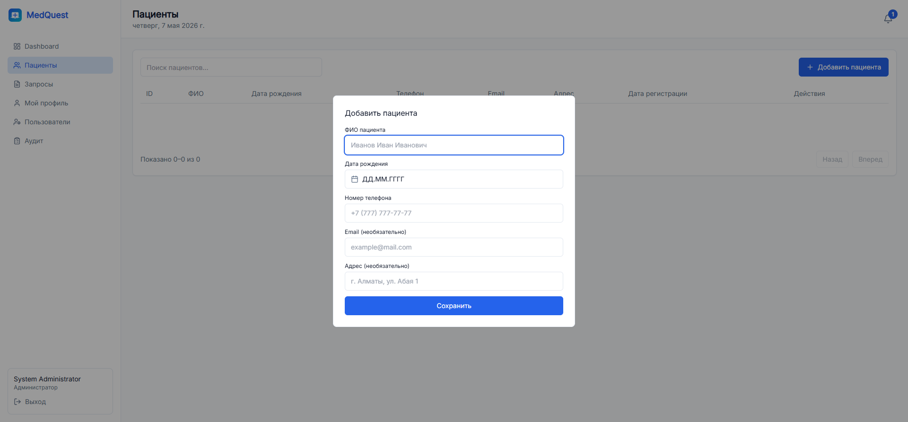

**Что это?** Раздел для регистрации и управления информацией о пациентах.

#### Таблица пациентов отображает:

| Колонка | Описание |
|---------|---------|
| **ID** | Уникальный номер пациента |
| **ФИО** | Полное имя пациента |
| **Дата рождения** | День рождения пациента |
| **Телефон** | Номер телефона для контакта |
| **Email** | Электронная почта |
| **Адрес** | Адрес проживания |
| **Дата регистрации** | Когда пациент был добавлен в систему |
| **Действия** | Кнопки для просмотра, редактирования, удаления |

#### Добавление нового пациента

Кнопка **"Добавить пациента"** открывает форму с полями:

1. **ФИО пациента** — обязательное поле
2. **Дата рождения** — выбирается из календаря
3. **Номер телефона** — с форматом +7 (XXX) XXX-XX-XX
4. **Email** — опциональное поле
5. **Адрес** — опциональное поле

**Пример добавленного пациента:**
- **Александр Сидоров**, 07.05.2026, +7 (777) 123-45-67, г. Алматы, ул. Мира 42, квартира 15

**Функции для каждого пациента:**
- **👁 Просмотр** — открыть полный профиль пациента
- **📋 Скопировать телефон** — скопировать номер в буфер обмена
- **📧 Скопировать email** — скопировать почту в буфер обмена
- **✏️ Редактировать** — изменить данные пациента
- **🗑️ Удалить** — удалить пациента из системы

---

### 4. Управление запросами (Requests)

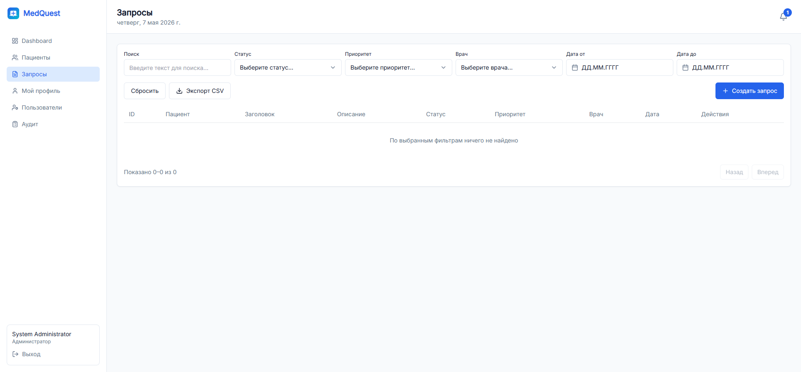
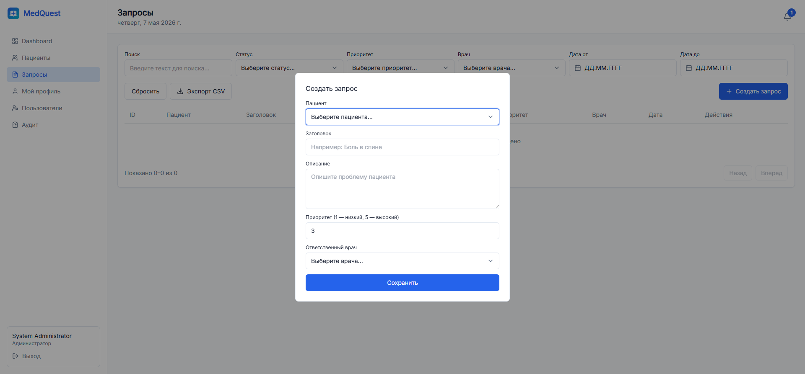
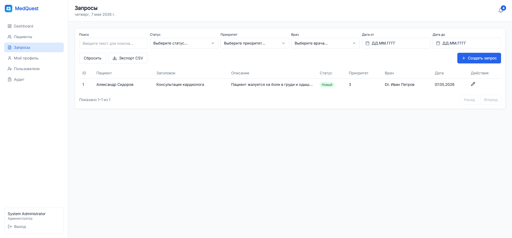
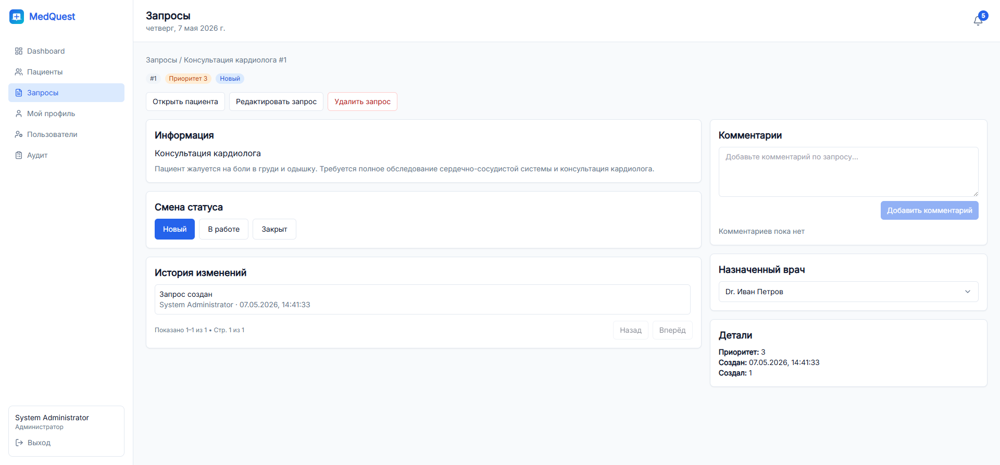

**Что это?** Центральный раздел системы для управления медицинскими запросами от пациентов.

#### Таблица запросов отображает:

| Колонка | Описание |
|---------|---------|
| **ID** | Номер запроса |
| **Пациент** | Кому принадлежит запрос |
| **Заголовок** | Краткое описание проблемы |
| **Описание** | Полное описание ситуации |
| **Статус** | Новый / В работе / Закрыт |
| **Приоритет** | От 1 (низкий) до 5 (высокий) |
| **Врач** | Врач, ответственный за запрос |
| **Дата** | Когда был создан запрос |

#### Фильтрация запросов

На странице доступны фильтры:

1. **Поиск** — по названию или описанию запроса
2. **Статус** — фильтровать по статусу (Новый, В работе, Закрыт)
3. **Приоритет** — фильтровать по приоритету (1-5)
4. **Врач** — показать запросы конкретного врача
5. **Дата от** — запросы после указанной даты
6. **Дата до** — запросы до указанной даты

**Кнопки действий:**
- **Сбросить** — очистить все фильтры
- **Экспорт CSV** — скачать таблицу в формате Excel
- **Создать запрос** — добавить новый запрос

#### Создание нового запроса

Форма содержит следующие поля:

1. **Пациент** — выбирается из списка существующих пациентов
2. **Заголовок** — краткое наименование (например: "Консультация кардиолога")
3. **Описание** — полное описание проблемы
4. **Приоритет** — число от 1 до 5 (1 = низкий, 5 = высокий)
5. **Ответственный врач** — врач, который будет заниматься запросом

**Пример созданного запроса:**
- **Пациент:** Александр Сидоров
- **Заголовок:** Консультация кардиолога
- **Описание:** Пациент жалуется на боли в груди и одышку. Требуется полное обследование сердечно-сосудистой системы.
- **Приоритет:** 3
- **Врач:** Dr. Иван Петров

#### Просмотр деталей запроса

При клике на запрос открывается страница деталей с информацией:

**Левая часть:**

1. **Информация**
   - Заголовок запроса
   - Полное описание
   
2. **Смена статуса** — кнопки для изменения статуса:
   - 🔵 **Новый** — запрос только что создан
   - 🟡 **В работе** — врач начал работать над запросом
   - 🟢 **Закрыт** — запрос завершён

3. **История изменений** — показывает все изменения с временем и автором

**Правая часть:**

1. **Комментарии** — текстовое поле для добавления комментариев
2. **Назначенный врач** — выбор врача для работы с запросом
3. **Детали** — информация о приоритете, дате создания и авторе

---

### 5. Управление пользователями

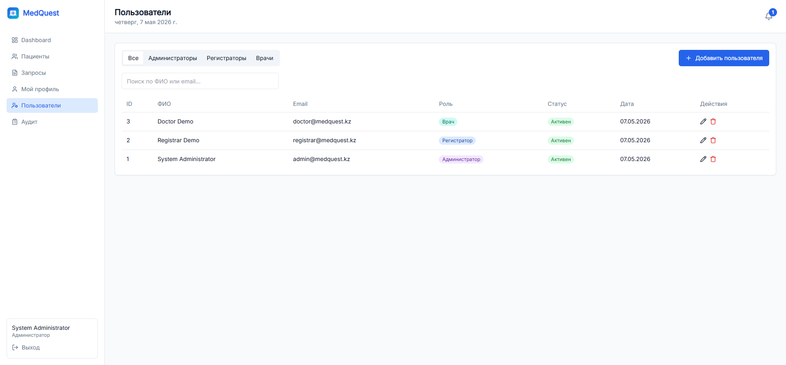
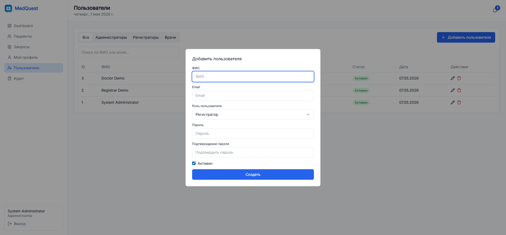

**Что это?** Раздел для управления сотрудниками системы (доступно только администраторам).

#### Таблица пользователей отображает:

| Колонка | Описание |
|---------|---------|
| **ID** | Номер пользователя |
| **ФИО** | Полное имя сотрудника |
| **Email** | Учётная почта для входа |
| **Роль** | Должность (Администратор / Регистратор / Врач) |
| **Статус** | Активен или деактивирован |
| **Дата** | Когда был создан аккаунт |

#### Роли пользователей

**1. Администратор** 🔓
- Полный доступ ко всем функциям
- Управление пользователями
- Просмотр аудита
- Создание и редактирование всех запросов

**2. Регистратор** 📋
- Регистрация новых пациентов
- Создание запросов
- Просмотр информации о пациентах
- Назначение врачей

**3. Врач** 👨‍⚕️
- Просмотр своих запросов
- Добавление комментариев
- Изменение статуса запроса
- Просмотр информации о пациентах

#### Добавление нового пользователя

Форма содержит:

1. **ФИО** — полное имя сотрудника
2. **Email** — электронная почта (уникальная)
3. **Роль пользователя** — выбирается из списка
4. **Пароль** — пароль для входа
5. **Подтверждение пароля** — повторный ввод пароля
6. **Активен** — чекбокс для активирования пользователя

**Пример добавленного пользователя:**
- **ФИО:** Dr. Иван Петров
- **Email:** ivan.petrov@medquest.kz
- **Роль:** Врач
- **Статус:** Активен

---

### 6. Аудит системы

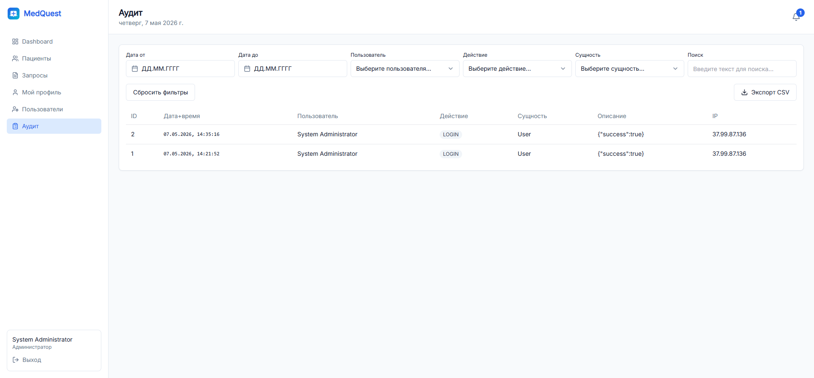

**Что это?** Раздел для просмотра логов всех действий в системе (доступно только администраторам).

**Аудит отслеживает:**
- Создание новых пациентов
- Создание и изменение запросов
- Смену статусов запросов
- Добавление комментариев
- Управление пользователями
- Вход и выход из системы

**Информация в логе:**
- **Кто** — ФИО и роль пользователя
- **Что** — какое действие было выполнено
- **Когда** — дата и время
- **Где** — какой объект был изменён

**Зачем это нужно?**
- Контроль безопасности
- Отслеживание ошибок
- Соответствие законодательству

---

## Новые функции в обновлении

### 1. Google OAuth (Вход с аккаунтом Google)

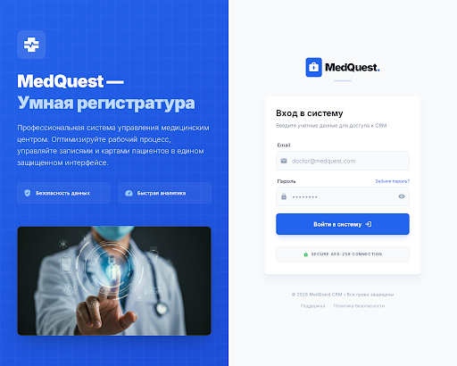

**Что это?** Функция для входа в систему через личный аккаунт Google без необходимости запоминать отдельный пароль.

**Возможности:**
- Быстрый вход с использованием учётной записи Google
- Безопасная аутентификация через OAuth 2.0
- Нет необходимости создавать и запоминать пароль
- Автоматическое заполнение профиля данными из Google

**Как использовать:**
1. На странице входа нажмите кнопку "Вход с аккаунтом Google"
2. Выберите или введите ваш Google аккаунт
3. Нажмите "Разрешить доступ"
4. Вы будете автоматически зарегистрированы в системе

**Преимущества:**
- ✅ Повышенная безопасность (Google управляет паролем)
- ✅ Удобство для пользователя
- ✅ Меньше ошибок при входе

---

### 2. Двухфакторная аутентификация (2FA)

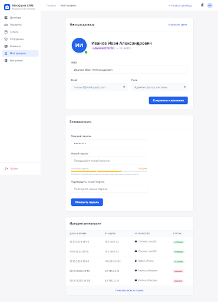

**Что это?** Дополнительный слой безопасности, требующий второе подтверждение при входе в систему.

**Возможности:**
- Включение/отключение 2FA в профиле
- Отправка кода подтверждения на телефон или email
- Резервные коды для восстановления доступа
- Поддержка приложений для аутентификации (Google Authenticator, Authy)

**Как включить 2FA:**
1. Перейдите в "Мой профиль"
2. Найдите раздел "Двухфакторная аутентификация"
3. Нажмите кнопку "Включить"
4. Выберите способ (SMS, Email или Authenticator App)
5. Подтвердите кодом

**Как работает при входе:**
1. Введите email и пароль
2. Система попросит ввести код подтверждения
3. Введите код из SMS, email или приложения
4. Вы будете залогированы

**Преимущества:**
- 🔒 Максимальная безопасность аккаунта
- 🛡️ Защита от несанкционированного доступа
- 📱 Удобные способы верификации

---

### 3. AI-Маршрутизатор

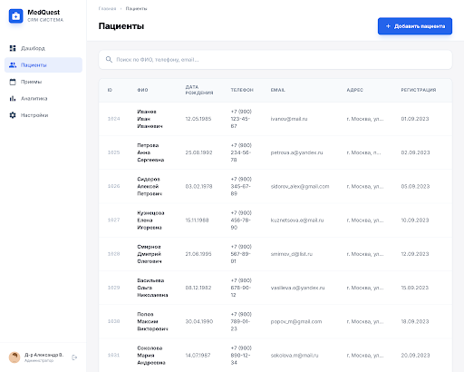

**Что это?** Искусственный интеллект, который автоматически определяет нужного специалиста на основе жалобы пациента.

**Возможности:**
- Анализ текста жалобы пациента с помощью AI
- Автоматическое предложение специалиста
- Примеры типичных жалоб для быстрого выбора
- Точность классификации на основе машинного обучения

**Как использовать:**
1. Перейдите в "AI-Маршрутизатор"
2. Введите жалобу пациента в текстовое поле (например: "Болит голова, головокружение, тошнота")
3. Нажмите кнопку "Определить специалиста"
4. AI предложит подходящего врача-специалиста

**Примеры жалоб:**
- "Болит голова, головокружение" → Невролог
- "Кашель и температура 38" → Терапевт/Пульмонолог
- "Боль в груди при дыхании" → Кардиолог
- "Высыпания на коже, зуд" → Дерматолог
- "Болит живот, тошнота" → Гастроэнтеролог
- "Боль в суставах, отёк" → Ревматолог

**Преимущества:**
- ⚡ Экономия времени регистратора
- 🎯 Точное направление пациента
- 📊 Использование AI для анализа
- 🔄 Постоянное обучение системы

---

### 4. Avatar (Аватар пользователя)


**Что это?** Персональное изображение (аватар) пользователя, отображающееся в профиле и системе.

**Возможности:**
- Инициалы пользователя (первая буква имени и фамилии)
- Цветной фон для каждого пользователя
- Отображение в интерфейсе и чатах
- Автоматическое создание аватара на основе имени

**Как выглядит:**
- Круглое изображение с буквами инициалов
- Разные цвета для разных пользователей
- Видно в левой части профиля

**Пример:**
- Администратор "Системный администратор" → Аватар "С" голубого цвета

**Преимущества:**
- 👤 Быстрое визуальное распознавание пользователя
- 🎨 Красивый интерфейс
- 🚀 Автоматическое создание без загрузки файлов

---

### 5. Детальный профиль пациента (Detail Profile)

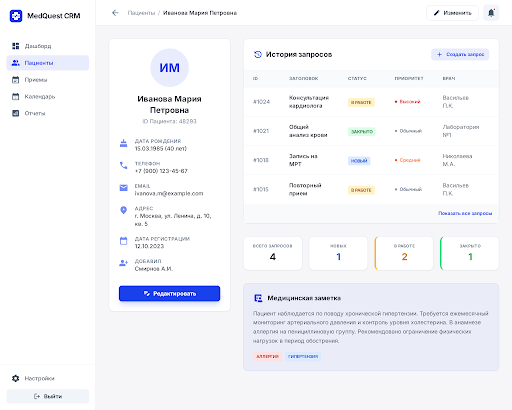

**Что это?** Полный профиль пациента со всей информацией и историей взаимодействия.

**Содержит информацию:**
- **Личные данные**
  - ФИО пациента
  - ИИН (Индивидуальный идентификационный номер)
  - Дата рождения
  - Пол
  - Группа крови
  - Адрес проживания

- **Контакты**
  - Номер телефона
  - Email адрес

- **Медицинская информация**
  - Известные аллергии
  - Хронические заболевания
  - Заметки врача

- **История запросов**
  - Все медицинские запросы пациента
  - Статус каждого запроса
  - Даты создания и завершения
  - Ответственные врачи

**Как открыть:**
1. Перейдите в "Пациенты"
2. Нажмите на имя пациента в таблице
3. Или нажмите кнопку "Просмотр" рядом с пациентом

**Доступные действия:**
- 📝 Редактировать данные пациента
- ➕ Создать новый запрос
- 📋 Просмотреть историю запросов
- 🔍 Поиск по истории

**Преимущества:**
- 📊 Полная информация о пациенте в одном месте
- 📈 История взаимодействия
- 🔗 Связь между запросами и пациентом

---

### 6. Расписание (Schedule)

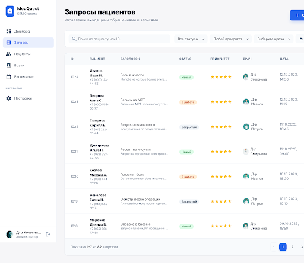

**Что это?** Календарное расписание приёмов пациентов и видеоконсультаций.

**Возможности:**
- Просмотр расписания врачей на неделю, месяц или день
- Создание новых приёмов и видеоконсультаций
- Управление временными слотами
- Отображение занятости врачей

**Элементы интерфейса:**
- **Календарь** с неделями
- **Вид** — переключение между Месяц, Неделя, День
- **Навигация** — перемещение по датам
- **Кнопка "Новый приём"** — создание события

**Как создать приём:**
1. Перейдите в "Расписание"
2. Нажмите "Новый приём"
3. Выберите врача, пациента, время
4. Укажите тип приёма (офис, видеоконсультация)
5. Нажмите "Сохранить"

**Что видно на расписании:**
- Время приёма (например: 09:00 - 09:30)
- Название приёма
- Врач, проводящий приём
- Статус (запланирован, проводится, завершён)

**Преимущества:**
- 📅 Полный контроль над графиком работы
- ⏰ Избежание двойных запланирований
- 👥 Удобное управление пациентами
- 🎯 Визуальное распланирование времени

---

### 7. Видеоконференция

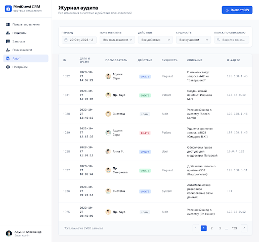

**Что это?** Возможность проведения видеоконсультаций между врачами и пациентами прямо в системе.

**Возможности:**
- Встроенная видеосвязь между пользователями
- Интеграция с системой чата
- Запись видеоконсультаций (опционально)
- HD качество видео
- Экран общего доступа для демонстрации результатов

**Как запустить видеоконсультацию:**
1. Перейдите в "Расписание"
2. Создайте приём типа "Видеоконсультация"
3. Система создаст уникальную ссылку для видеозвонка
4. Врач и пациент получат уведомление
5. В назначенное время откроется видеоокно

**Как работает в интерфейсе:**
- Кнопка видеозвонка появляется рядом со статусом приёма
- При клике открывается камера и микрофон
- Обе стороны видят друг друга в реальном времени

**Преимущества:**
- 🎥 Консультации без физического присутствия
- 🏥 Снижение затрат на помещение
- 🌍 Доступность для удалённых пациентов
- ✅ Современный уровень медицинского обслуживания

---

### 8. Чат

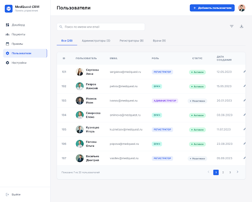

**Что это?** Встроенная система обмена сообщениями между врачами, регистраторами и пациентами.

**Возможности:**
- Текстовая переписка с другими пользователями
- История всех сообщений в системе
- Быстрый поиск контактов
- Создание нового чата
- Интеграция с видеоконференциями
- Уведомления о новых сообщениях

**Интерфейс чата:**

**Левая панель:**
- Кнопка "Новый чат" для создания беседы
- Список контактов (врачи, пациенты, коллеги)
- Поиск по имени

**Правая панель:**
- История переписки с выбранным контактом
- Поле для ввода нового сообщения
- Кнопка отправки

**Типы чатов:**
- **Личные чаты** — один на один с врачом/пациентом
- **Групповые чаты** — обсуждение в группе врачей
- **Чаты с пациентами** — консультирование

**Как использовать:**
1. Перейдите в "Чат"
2. Выберите контакт из списка или нажмите "Новый чат"
3. Введите сообщение в нижнее поле
4. Нажмите кнопку отправки или Enter

**Пример контактов в системе:**
- Baltabek Oralbaev (Врач)
- Регистратор
- Врач Айнара
- Главрач Иван Петров

**Преимущества:**
- 💬 Быстрое общение без email
- 📱 Удобный интерфейс
- ⚡ История сообщений всегда доступна
- 🔔 Уведомления о новых сообщениях

---

## Пошаговые примеры использования

### Сценарий 1: Регистрация нового пациента

**Этапы:**

1. **Войти в систему**
   - Открыть http://med-request.vercel.app
   - Нажать на кнопку "Регистратор"
   - Нажать "Войти"

2. **Перейти на страницу Пациентов**
   - В левой панели нажать "Пациенты"

3. **Добавить нового пациента**
   - Нажать кнопку "Добавить пациента"
   - Заполнить форму:
     - ФИО: "Иван Сергеевич Смирнов"
     - Дата рождения: "15.03.1980"
     - Телефон: "+7 (777) 555-55-55"
     - Email: "ivan.smirnov@mail.com"
     - Адрес: "г. Алматы, ул. Казыбек Би, дом 5"
   - Нажать "Сохранить"

4. **Проверка**
   - Пациент появится в таблице
   - Можно скопировать контактные данные
   - Можно открыть профиль пациента

---

### Сценарий 2: Создание медицинского запроса

**Этапы:**

1. **Войти в систему** (как Регистратор)

2. **Перейти на страницу Запросы**
   - В левой панели нажать "Запросы"

3. **Создать новый запрос**
   - Нажать "Создать запрос"
   - Выбрать пациента: "Александр Сидоров"
   - Заголовок: "УЗИ сердца"
   - Описание: "Пациент жалуется на перебои в работе сердца. Требуется УЗИ диагностика."
   - Приоритет: "4" (средне-высокий)
   - Врач: "Dr. Иван Петров"
   - Нажать "Сохранить"

4. **Проверка**
   - Запрос появится в таблице
   - Статус по умолчанию "Новый"
   - Врач получит уведомление

---

### Сценарий 3: Обработка запроса врачом

**Этапы:**

1. **Войти в систему** (как Врач: doctor@medquest.kz)

2. **Перейти на Запросы**

3. **Открыть запрос**
   - Нажать на номер запроса в таблице
   - Откроется страница с деталями

4. **Обработать запрос**
   - Изменить статус с "Новый" на "В работе"
   - Добавить комментарий: "Начало диагностики"
   - Нажать "Добавить комментарий"

5. **Завершить запрос**
   - Добавить финальный комментарий: "УЗИ показало норму. Рекомендую кардиолога."
   - Изменить статус на "Закрыт"

---

### Сценарий 4: Просмотр аудита

**Этапы:**

1. **Войти как Администратор**

2. **Перейти в Аудит**
   - Нажать "Аудит" в левой панели

3. **Просмотреть логи**
   - Увидеть все действия пользователей
   - Фильтровать по дате, пользователю или типу действия

---

## Основные технологии

### Frontend (Клиентская часть)

**React 18** — современная библиотека для создания пользовательских интерфейсов
- Компонентная архитектура
- Реактивное обновление данных
- Состояние (State) и эффекты (Effects)

**TypeScript** — типизированный JavaScript
- Предотвращает ошибки на этапе разработки
- Улучшает качество кода
- Облегчает поддержку

**Tailwind CSS** — утилиты для быстрого стилизирования
- Классы для оформления элементов
- Адаптивный дизайн для всех устройств
- Быстрая разработка интерфейса

**Axios** — библиотека для HTTP запросов
- Простой API для запросов к серверу
- Автоматическая сериализация JSON
- Обработка ошибок

### Backend (Серверная часть)

**FastAPI** — быстрый фреймворк для создания API
- Автоматическая документация (Swagger)
- Валидация данных из коробки
- Асинхронная обработка запросов
- Простая интеграция с базами данных

**SQLAlchemy** — ORM (Object-Relational Mapping) для работы с БД
- Объектно-ориентированная работа с данными
- Автоматические миграции
- Защита от SQL-инъекций

**Pydantic** — библиотека для валидации данных
- Проверка типов
- Автоматическое преобразование данных
- Красивые сообщения об ошибках

**JWT (JSON Web Tokens)** — стандарт для аутентификации
- Безопасный способ передачи информации
- Может быть проверен без связи с сервером
- Экономит ресурсы сервера

---

## Структура данных

### Таблица Users (Пользователи)

```
┌─────────────────────────────────────────┐
│              USERS                      │
├─────────────────────────────────────────┤
│ id: INTEGER (PRIMARY KEY)               │
│ email: VARCHAR (UNIQUE)                 │
│ full_name: VARCHAR                      │
│ hashed_password: VARCHAR                │
│ role: ENUM (admin, registrar, doctor)  │
│ is_active: BOOLEAN                      │
│ created_at: DATETIME                    │
└─────────────────────────────────────────┘
```

### Таблица Patients (Пациенты)

```
┌─────────────────────────────────────────┐
│            PATIENTS                     │
├─────────────────────────────────────────┤
│ id: INTEGER (PRIMARY KEY)               │
│ full_name: VARCHAR                      │
│ date_of_birth: DATE                     │
│ phone: VARCHAR                          │
│ email: VARCHAR                          │
│ address: VARCHAR                        │
│ created_at: DATETIME                    │
│ created_by: INTEGER (FK → Users)       │
└─────────────────────────────────────────┘
```

### Таблица PatientRequests (Запросы)

```
┌──────────────────────────────────────────┐
│        PATIENT_REQUESTS                  │
├──────────────────────────────────────────┤
│ id: INTEGER (PRIMARY KEY)                │
│ patient_id: INTEGER (FK → Patients)     │
│ title: VARCHAR                           │
│ description: TEXT                        │
│ status: ENUM (new, in_progress, closed) │
│ priority: INTEGER (1-5)                  │
│ assigned_doctor_id: INTEGER (FK → Users)│
│ created_at: DATETIME                     │
│ created_by: INTEGER (FK → Users)        │
│ updated_at: DATETIME                     │
└──────────────────────────────────────────┘
```

### Таблица RequestComments (Комментарии)

```
┌──────────────────────────────────────────┐
│       REQUEST_COMMENTS                   │
├──────────────────────────────────────────┤
│ id: INTEGER (PRIMARY KEY)                │
│ request_id: INTEGER (FK → PatientRequest)│
│ user_id: INTEGER (FK → Users)           │
│ text: TEXT                               │
│ created_at: DATETIME                     │
└──────────────────────────────────────────┘
```

### Таблица AuditLogs (Аудит)

```
┌──────────────────────────────────────────┐
│          AUDIT_LOGS                      │
├──────────────────────────────────────────┤
│ id: INTEGER (PRIMARY KEY)                │
│ user_id: INTEGER (FK → Users)           │
│ action: VARCHAR                          │
│ entity_type: VARCHAR                     │
│ entity_id: INTEGER                       │
│ details: JSON                            │
│ created_at: DATETIME                     │
└──────────────────────────────────────────┘
```

---

## Роли и права доступа

### Матрица прав доступа

| Функция | Администратор | Регистратор | Врач |
|---------|:---:|:---:|:---:|
| **Пациенты** | | | |
| Просмотр списка | ✅ | ✅ | ✅ |
| Добавление | ✅ | ✅ | ❌ |
| Редактирование | ✅ | ✅ | ❌ |
| Удаление | ✅ | ✅ | ❌ |
| **Запросы** | | | |
| Просмотр списка | ✅ | ✅ | ✅ |
| Создание | ✅ | ✅ | ❌ |
| Редактирование | ✅ | ✅ | ✅* |
| Удаление | ✅ | ✅ | ❌ |
| Добавление комментариев | ✅ | ✅ | ✅ |
| **Пользователи** | | | |
| Просмотр списка | ✅ | ❌ | ❌ |
| Добавление | ✅ | ❌ | ❌ |
| Редактирование | ✅ | ❌ | ❌ |
| Удаление | ✅ | ❌ | ❌ |
| **Аудит** | | | |
| Просмотр логов | ✅ | ❌ | ❌ |
| **Профиль** | | | |
| Редактирование своего | ✅ | ✅ | ✅ |
| Смена пароля | ✅ | ✅ | ✅ |

*Врач может редактировать только статус и добавлять комментарии

---

## Процесс жизненного цикла запроса

```
                  ┌─────────────────────┐
                  │   СОЗДАНИЕ ЗАПРОСА  │
                  │  Статус: "Новый"    │
                  └──────────┬──────────┘
                             │
                             ▼
        ┌──────────────────────────────────────┐
        │  НАЗНАЧЕНИЕ ВРАЧА (опционально)      │
        │  Администратор/Регистратор           │
        │  назначают врача через выпадающее    │
        │  меню на странице запроса            │
        └──────────────────┬───────────────────┘
                           │
                           ▼
        ┌──────────────────────────────────────┐
        │   ВРАЧ ПРИНЯЛ К РАБОТЕ               │
        │   Статус: "В работе"                 │
        │   Врач может добавлять комментарии   │
        └──────────────────┬───────────────────┘
                           │
                           ▼
        ┌──────────────────────────────────────┐
        │   ПРОВЕДЕНИЕ ДИАГНОСТИКИ             │
        │   Врач описывает процесс в           │
        │   комментариях                       │
        └──────────────────┬───────────────────┘
                           │
                           ▼
        ┌──────────────────────────────────────┐
        │   ЗАВЕРШЕНИЕ ЗАПРОСА                 │
        │   Статус: "Закрыт"                   │
        │   Врач добавляет итоговый комментарий│
        └──────────────────┬───────────────────┘
                           │
                           ▼
        ┌──────────────────────────────────────┐
        │   ЗАПРОС В АРХИВЕ                    │
        │   Доступен для просмотра и экспорта  │
        └──────────────────────────────────────┘
```

---

## Интеграция между компонентами

### Поток данных при создании запроса

```
1. Пользователь заполняет форму (Frontend)
   ↓
2. Форма отправляется на сервер (HTTP POST /requests)
   ↓
3. FastAPI получает данные и валидирует их (Pydantic)
   ↓
4. Сохраняет в базу данных (SQLAlchemy)
   ↓
5. Создаёт запись в аудите (автоматически)
   ↓
6. Создаёт уведомление для врача
   ↓
7. Возвращает ответ клиенту (HTTP 200 OK)
   ↓
8. Frontend показывает успешное сообщение
   ↓
9. Таблица обновляется с новым запросом
```

---

## Безопасность

### Защита данных

1. **Аутентификация (JWT токены)**
   - Каждый запрос должен содержать валидный токен
   - Токен генерируется при входе
   - Токен содержит информацию о пользователе и его роли

2. **Авторизация (проверка прав)**
   - Система проверяет роль пользователя
   - Разные роли имеют разные права

3. **Хеширование паролей**
   - Пароли не хранятся в открытом виде
   - Используется криптографическое хеширование

4. **Валидация входных данных**
   - Все данные проверяются перед сохранением
   - Проверяются типы и формат

5. **Аудит действий**
   - Все действия логируются
   - Можно отследить кто, когда и что сделал

---

## Типичные сценарии использования

### 1️⃣ Администратор создаёт регистратора
1. Входит в систему с админ аккаунтом
2. Идёт в "Пользователи"
3. Нажимает "Добавить пользователя"
4. Заполняет данные, выбирает роль "Регистратор"
5. Регистратор получает письмо с инструкциями

### 2️⃣ Регистратор регистрирует пациента
1. Входит в систему
2. Идёт в "Пациенты"
3. Нажимает "Добавить пациента"
4. Вводит данные пациента
5. Пациент добавлен в систему

### 3️⃣ Регистратор создаёт запрос
1. Идёт в "Запросы"
2. Нажимает "Создать запрос"
3. Выбирает пациента
4. Описывает проблему
5. Выбирает врача
6. Нажимает "Сохранить"

### 4️⃣ Врач обрабатывает запрос
1. Видит новый запрос в списке
2. Открывает запрос
3. Меняет статус на "В работе"
4. Добавляет комментарий о проведённой диагностике
5. После завершения меняет статус на "Закрыт"

### 5️⃣ Администратор смотрит аудит
1. Идёт в "Аудит"
2. Видит всю историю действий
3. Может проверить кто-когда-что сделал
4. Скачивает отчёт в Excel

---

## Ключевые выводы

### Преимущества системы

✅ **Простота использования** — интуитивный интерфейс, понятная навигация

✅ **Эффективность** — все инструменты на одной платформе

✅ **Безопасность** — JWT аутентификация, валидация данных, аудит

✅ **Масштабируемость** — архитектура позволяет легко добавлять новые функции

✅ **Оффлайн возможности** — данные могут работать в режиме оффлайн

✅ **Экспорт данных** — все отчёты можно скачать в CSV

### Возможные улучшения

🔄 **Интеграция с email** — автоматическая отправка уведомлений

📱 **Мобильное приложение** — доступ с телефона

📊 **Расширенная аналитика** — более подробные графики и отчёты

🔔 **Уведомления в реальном времени** — WebSocket

💬 **Видеоконсультации** — интеграция с системами видеозвонков

---

## Контактная информация

**Проект:** MedQuest - CRM для медицинского центра

**Версия:** 2.0.0 (с новыми функциями)

**Дата последнего обновления:** 24.05.2026

**Дата создания:** 07.05.2026

**Развёрнуто на:** Vercel (https://med-request.vercel.app)

**Стек:** React + TypeScript + FastAPI + SQLite

**Новые функции добавлены в версии 2.0.0:**
- Google OAuth для удобного входа
- Двухфакторная аутентификация для повышения безопасности
- AI-Маршрутизатор для автоматического определения специалиста
- Аватары пользователей
- Расширенный профиль пациента с полной историей
- Интегрированное расписание врачей
- Видеоконференции для удалённых консультаций
- Встроенный чат для общения

---

*Документация подготовлена для дипломной работы. Все примеры показаны с использованием демонстрационных данных.*
